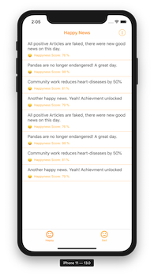
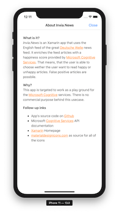

# Invia.News

> This is a simple use case and play-around Xamarin.Forms Android and iOS app to use the [Microsoft Cogntive Service](https://www.microsoft.com/cognitive-services/en-us/apis) Text Analytics API. It parses the English version of the [Deutsche Welle](http://www.dw.com/en/top-stories/s-9097) news and calculates the individual happiness (sentiment) of each article.

## Prerequirements
- Windows 10 / macOS 
- Visual Studio 2019 (for Mac)
- Installed Xamarin Visual Studio plugins
- [Microsoft Cognitive Services account](https://www.microsoft.com/cognitive-services/en-us/sign-up) credentials

## Features
- It parses the DW feed
- It calculates the happyness score of each article
- It splits the article in happy and sad.

## Usage
1. Copy and paste the Text Analytics API service key and endpoint to the constantsn `ANALYTICS_SUBSCRIPTION_KEY` and `ANALYTICS_ENDPOINT` in the `ArticleService.cs` file
1. Run the Android or iOS project

## How it looks

  

## Keep in mind
This is a proof-of-concept app that's purely build for having fun! All features have room for improvements or could show **very** wrong results.

## Publications
- Dr. Windows: [Wir bauen uns glückliche Nachrichten mit Xamarin und Azure](https://www.drwindows.de/news/wir-bauen-uns-glueckliche-nachrichten-mit-xamarin-und-azure)

## Contributing
Feel free to improve the quality of the code. It would be great to learn more from experienced C#, Xamarin and Azure developers.

## Authors
Just me, [Tobi]([https://tscholze.github.io).

## Links
- [Xamarin](https://dotnet.microsoft.com/apps/xamarin) Homepage
- [Microsoft Cognitive Services](https://www.microsoft.com/cognitive-services/) 
- [materialdesignicons.com](https://materialdesignicons.com) as source for all of the icons

## License
This project is licensed under the MIT License - see the [LICENSE](LICENSE.md) file for details.
Dependencies or assets maybe licensed differently.
